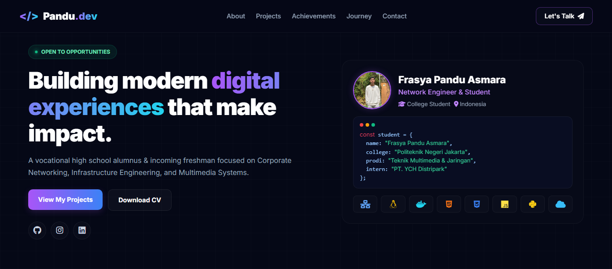

<p align="center">
  
</p>

<div align="center">

Personal portfolio website built with HTML, CSS, and JavaScript.  
Clean glassmorphism UI with smooth animations, fully responsive across all devices.

[](https://frasyapanduasmara.my.id)
[](https://tailwindcss.com/)
[](https://javascript.com/)
[](LICENSE)

</div>

---

## 🚀 Overview

This project is a modern developer portfolio designed to showcase:
- Technical skills
- Networking projects
- Linux server experience
- Web development projects
- Professional profile and achievements

Built with a futuristic glassmorphism design and optimized for performance, responsiveness, and modern user experience.

---

## ✨ Features

- 🎨 Modern Glassmorphism UI
- ⚡ Smooth Animations & Transitions
- 📱 Fully Responsive Design
- 🌙 Dark / Light Mode (remembers your choice)
- 🗂️ Data-driven content — edit one file, no HTML digging
- 🔎 SEO-ready (meta tags, Open Graph, JSON-LD)
- 🚀 Fast Loading Performance
- 🌐 Custom Domain Support
- 💻 Clean & Organized Code Structure

---

## 🛠️ Tech Stack

| Technology | Role |
|---|---|
| HTML5 | Structure & semantic layout |
| CSS3 | Custom styling, glassmorphism, animations |
| JavaScript | Interactivity, scroll effects, form handling |
| Font Awesome 6 | Icons |
| Google Fonts (Inter) | Typography |
| TailwindCSS (CDN) | Utility class supplement |
| FormSubmit | Contact form backend |

---

## 📸 Preview

<p align="center">
  
</p>

---

## 🌍 Live Demo

🔗 Website:  
👉 https://frasyapanduasmara.my.id

---

## 📂 Project Structure

```bash
.
├── assets/
│   ├── favicon.ico
│   ├── profile.jpeg
│   ├── preview.png
│   └── cv.pdf            # (optional) your CV — wired to the "Download CV" button
├── css/
│   └── style.css         # all styling (dark theme + light theme)
├── js/
│   ├── data/             # ← EDIT THESE to change site content
│   │   ├── profile.js        profile, hero, terminal, socials, contact
│   │   ├── skills.js         skill badges
│   │   ├── projects.js       project cards
│   │   ├── achievements.js   competition awards
│   │   ├── certificates.js   formal certifications
│   │   └── experience.js     journey timeline
│   ├── render.js         builds the HTML from the data files
│   └── main.js           interactions, theme toggle, form handling
├── CNAME
├── LICENSE
├── README.md
└── index.html            structure only — content lives in js/data/
```

> **How it works:** `index.html` holds the layout and empty containers.
> The files in `js/data/` hold the content. On load, `js/render.js` reads the
> data and fills the page. **You should never need to touch `index.html` or
> `render.js` to update content — just edit the data files.** No build step,
> no framework — it stays a plain static site for GitHub Pages.

---

## ✍️ Content Management

All content lives in `js/data/`. Each file is plain JavaScript and is heavily
commented. After editing, save and refresh the page (or push to GitHub Pages).
**Keep the commas between items and the quotes around text.**

### ➕ Add a project
Open **`js/data/projects.js`** and add a block to the `PROJECTS` list:

```js
{
    icon: "fa-solid fa-server",   // any Font Awesome 6 icon class
    iconColor: "text-purple-400", // Tailwind text color
    title: "My New Project",
    description: "Short description of what it does.",
    tags: ["Tag1", "Tag2"],
},
```

### 🏅 Add an achievement (competition / award)
Open **`js/data/achievements.js`** and add a block to `ACHIEVEMENTS`:

```js
{
    icon: "fa-solid fa-trophy",
    iconColor: "text-amber-400",
    badge: "1st Place",
    badgeClass: "gold",           // "gold" | "silver" | "bronze"
    title: "Competition Name",
    subtitle: "Category — Level",
    year: "2026",
    url: "https://link-to-certificate",
},
```

### 📜 Add a certificate (formal certification)
Open **`js/data/certificates.js`** and add a block to `CERTIFICATES` (same
shape as an achievement). Achievements show first, certificates after — both
in the **Certificates & Achievements** section.

### 🕒 Add a journey / experience entry
Open **`js/data/experience.js`** and add a block to `EXPERIENCE` (top-to-bottom
= order shown). `subtitles` is a list of sub-headings; `dotColor`, `borderColor`
and `bg` are optional for highlighting an entry.

### 👤 Update your profile
Open **`js/data/profile.js`** — name, role, location, hero text, the terminal
snippet, tech icons, social links, contact email, and the footer line. This is
the file you'll edit most.

### 🛠️ Update your skills
Open **`js/data/skills.js`** — each badge has a name, a level
(`"intermediate"` cyan / `"advanced"` purple), and a detail line.

---

## 📄 CV Download

The hero **Download CV** button links to the `cvUrl` set in
`js/data/profile.js` (default `assets/cv.pdf`). Drop your CV file into the
`assets/` folder with that name — or change `cvUrl` to match your filename.

---

## 🌙 Dark / Light Mode

A theme toggle sits in the navbar. The site defaults to its original dark
theme; the choice is saved in `localStorage` and applied before paint (no
flash) on the next visit.

---

## 👤 Author

**Frasya Pandu Asmara**  
📧 frasyapanduasmara@gmail.com  
🌐 https://frasyapanduasmara.my.id  
🐱‍👤 https://github.com/PanduAsmara
